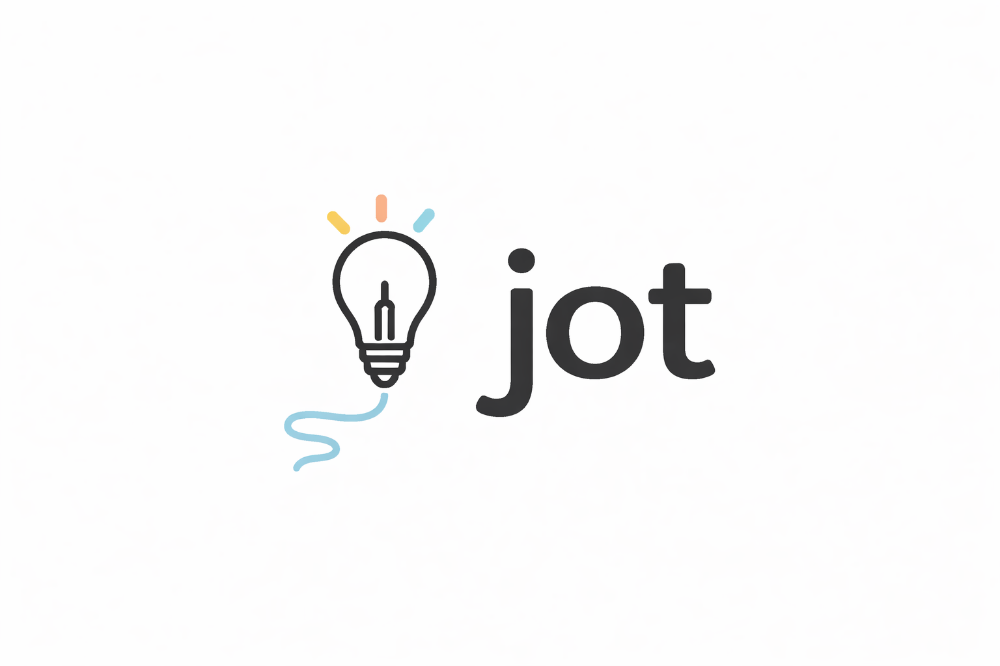

<p align="center">
  
</p>

<p align="center">
  Voice-to-idea capture for Mac. Open → speak → saved.
</p>

<p align="center">
  <strong>Menu bar app · Cmd+Shift+J from anywhere · Auto-saves on silence</strong>
</p>

---

## Install

### Download (easiest)

1. Grab `Jot-0.1.2.dmg` from [Releases](../../releases/latest)
2. Open the DMG, drag **Jot** into Applications
3. First launch: macOS will block it — go to **System Settings → Privacy & Security → Open Anyway**
4. Jot appears in your menu bar. Done.

### Build from source

Requirements: [Rust](https://rustup.rs) · [Node.js 20+](https://nodejs.org) · [pnpm](https://pnpm.io)

```bash
git clone https://github.com/vedchitnis/jot
cd jot
pnpm install
pnpm build          # builds the app
bash scripts/build-dmg.sh   # packages release/Jot-x.x.x.dmg
```

Or `pnpm release` to do both in one shot.

---

## Usage

| Action | How |
|---|---|
| Open Jot | Click the waveform icon in your menu bar, or press **⌘⇧J** |
| Record | Tap the mic button |
| Auto-save | Just stop talking — Jot saves after 4 seconds of silence |
| Save manually | Click **save** after recording stops |
| Discard | Click **discard**, or press **Esc** |
| Browse jots | Click the jot count at the bottom of the record screen |
| Close panel | Click anywhere outside Jot |

---

## Configuration

Open ⚙ in the top-left corner to configure. Settings are saved to `~/.config/jot/.env`.

You can also set any of these in your shell and they'll take precedence over the settings panel:

| Variable | Purpose |
|---|---|
| `JOT_OPENAI_API_KEY` | Whisper transcription (`sk-...`) |
| `JOT_ELEVENLABS_API_KEY` | ElevenLabs transcription |
| `JOT_GITHUB_PAT` | GitHub sync — fine-grained PAT with Contents: read+write |
| `JOT_GITHUB_REPO` | GitHub sync repo (`owner/repo`, must be private) |
| `JOT_OBSIDIAN_VAULT_PATH` | Obsidian export path (e.g. `/Users/you/Documents/MyVault`) |

---

## Transcription engines

| Engine | Quality | Cost | Setup |
|---|---|---|---|
| **webspeech** (default) | Good | Free | None — works out of the box |
| **whisper** | Great | ~$0.006/min | Add `JOT_OPENAI_API_KEY` |
| **elevenlabs** | Great | See ElevenLabs pricing | Add `JOT_ELEVENLABS_API_KEY` |

Switch engines using the pills in the top-right of the record screen.

---

## Sync

### GitHub
Jots are pushed as markdown files to a private GitHub repo. Bidirectional — pulling brings in jots saved from other machines.

Setup: add your PAT + repo in ⚙ Settings → GitHub sync.

### Obsidian
Exports all jots to `{vault}/Jots/*.md` as markdown with YAML frontmatter. One-way export.

Setup: add your vault path in ⚙ Settings → Obsidian.

---

## Privacy

- Everything stays local by default (localStorage in the app's WebView data)
- GitHub sync only uploads to **your own private repo**
- API keys are stored in `~/.config/jot/.env` — never sent anywhere except the respective API
- No telemetry, no analytics, no accounts

---

## Troubleshooting

**Jot won't open after install (macOS Gatekeeper)**
Go to System Settings → Privacy & Security → scroll down → Open Anyway.

**Microphone permission denied**
Go to System Settings → Privacy & Security → Microphone → enable Jot.

**Speech recognition not working**
Web Speech (the default) requires an internet connection and uses the macOS/Chrome speech engine. If you're offline, switch to Whisper.

**The window doesn't appear when I click the tray icon**
Try the keyboard shortcut: **⌘⇧J**. If that doesn't work, quit and relaunch from Applications.
